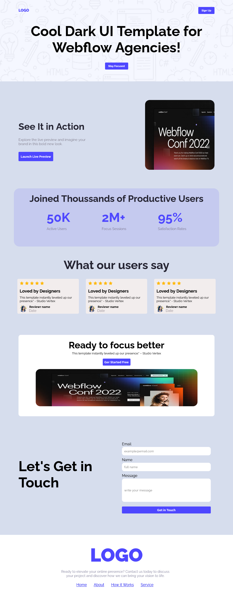

# Assignment-1-Ph
Shohoj Shorol Simple and enjoyable html css project
---
## Live Link

[View Live Site](https://anika1111122222.github.io/Assignment-1-Ph/)  
---
## Project Screenshort
  
---

## 🔗 Connect With Me

## Features

- Clean layout with multiple sections  
- Responsive design using Flexbox  
- Button hover and transition effects  
- Contact form and styled footer

---

## Tools Used

- HTML5  
- CSS3  
- Google Fonts

---

## Author

Anika Sultana | Programming Hero Student  
July 2025

